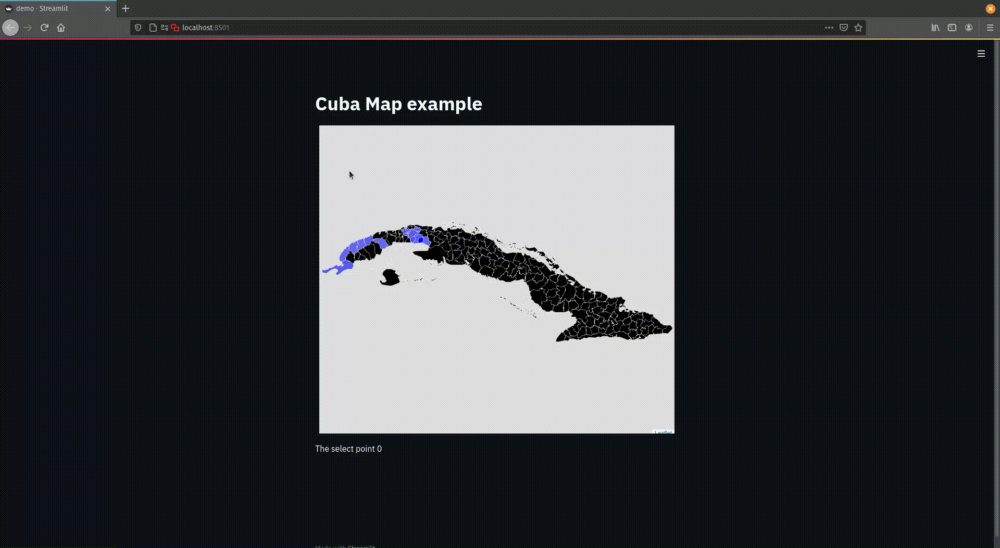

# Cubamap Streamlit component

# Installation

```bash
pip install cubamap
```

# Usage
For now the package only contain 1 widget (`cuba_mun_map`).
This widget need a parameter `mun_map` in the format of a map between the
municipalities codes of Cuba and a number between 0 and 1 to denote the color strenght.

## Example
```python
import streamlit as st
from cubamap import cuba_mun_map

st.title('Cuba Map example')

mun_data = {
    "21.01": 0.6000600060006,
    "21.02": 0.549054905490549,
    "21.03": 0.5410541054105411,
    "21.04": 0.5460546054605461,
    "21.05": 0.5740574057405741,
    "22.11": 0.534053405340534,
    "23.12": 0.6266626662666267,
    "23.13": 0.65006500650065,
    "23.14": 0.6400640064006401,
    "23.15": 0.6514651465146515,
    "24.01": 0.53005300530053,
    "24.02": 0.5925592559255926,
    "24.03": 0.555055505550555,
    "24.06": 0.5330533053305331,
    "24.07": 1.0,
    "24.08": 0.5800580058005801,
    "24.09": 0.648064806480648,
}

point = cuba_mun_map(mun_map=mun_data)


st.write(f'The select point {point}')
```



# Build and Publish

## Build frontend

```bash
$ cd cubamap/frontend
$ npm run build
```

## Build wheel

```bash
$ python setup.py sdist bdist_wheel
```

## Publish

```bash
twine upload dist/*
```